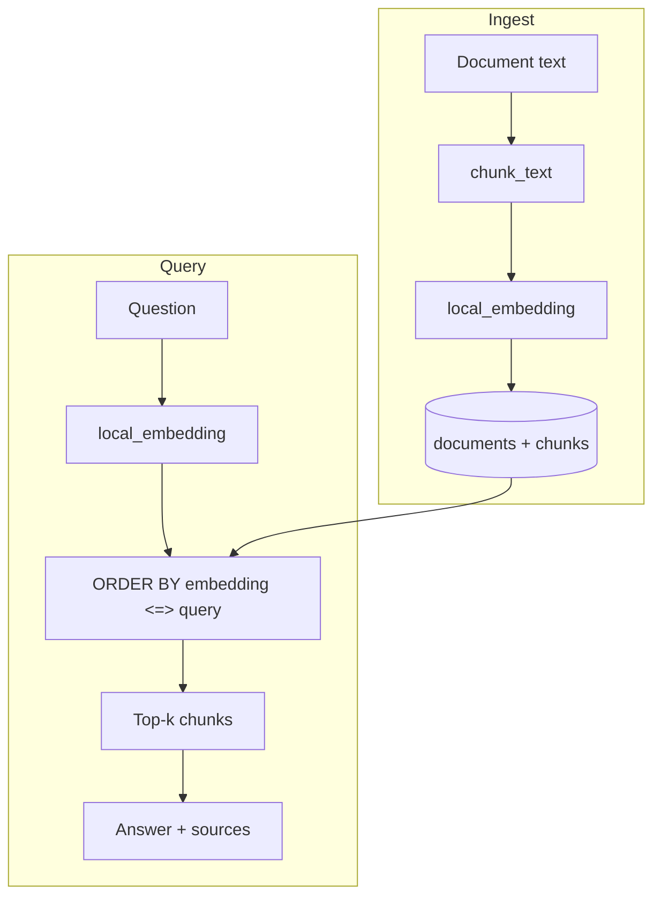
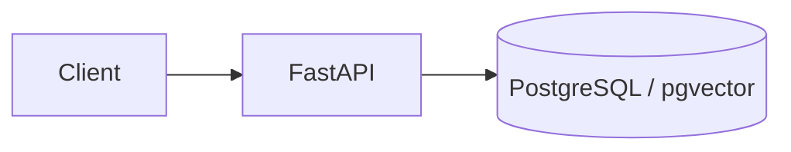

# RAGForge Platform

FastAPI backend for document ingestion, text chunking, embeddings, and vector search over PostgreSQL with pgvector.

## Architecture





## API

| Method | Path | Description |
|--------|------|-------------|
| `GET` | `/health` | Liveness |
| `POST` | `/api/v1/documents` | Ingest `{title, content}` |
| `GET` | `/api/v1/search?q=&limit=` | Top-k similar chunks |
| `GET` | `/api/v1/answer?q=` | Top chunk as answer plus sources |

OpenAPI UI: http://localhost:8001/docs

## Run

```bash
cp .env.example .env
docker compose up -d --build
```

- API: http://localhost:8001
- Postgres: localhost:5433

## Layout

```
app/
  main.py         routes
  chunking.py     overlapping splitter
  embeddings.py   64-dim local hash vectors
  db.py           schema + connections
  config.py       settings
tests/
docs/
```

## Tests

```bash
pip install -e '.[dev]'
pytest -q
```
