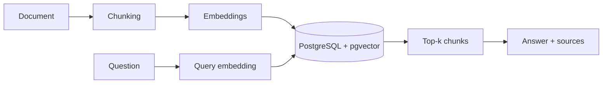
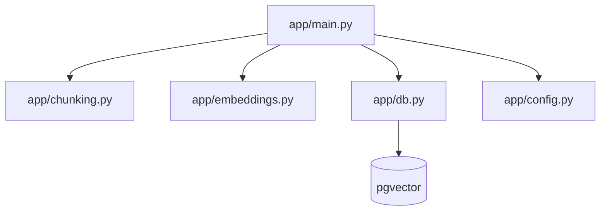

# Architecture

## Ingest and retrieval

```mermaid
flowchart LR
  Document --> Chunking --> Embeddings --> DB[(PostgreSQL + pgvector)]
  Question --> QueryEmbed[Query embedding] --> DB
  DB --> TopK[Top-k chunks] --> Response[Answer + sources]
```

## Components

```mermaid
flowchart TB
  main[app/main.py] --> chunking[app/chunking.py]
  main --> embeddings[app/embeddings.py]
  main --> db[app/db.py]
  db --> postgres[(pgvector)]
  main --> config[app/config.py]
```

