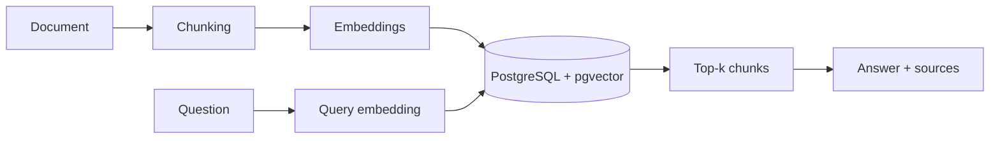

# Architecture

## Ingest and retrieval



## Components

  main[app/main.py] --> chunking[app/chunking.py]
  main --> embeddings[app/embeddings.py]
  main --> db[app/db.py]
  db --> postgres[(pgvector)]
  main --> config[app/config.py]
```

## Data model

- `documents`: `id`, `title`, `content`, `created_at`
- `chunks`: `id`, `document_id`, `chunk_index`, `content`, `embedding vector(64)`

Search uses cosine distance (`<=>`) over `chunks.embedding`. Embeddings are produced by `local_embedding` in `app/embeddings.py`.
