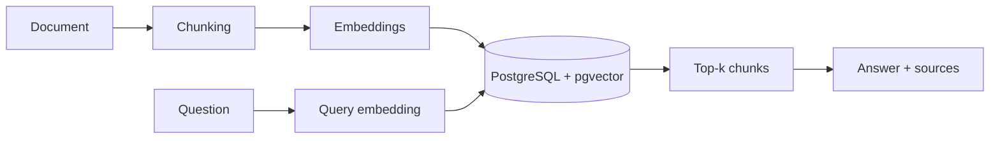

# Architecture

## Ingest and retrieval

```mermaid
flowchart LR
  Document --> Chunking --> Embeddings --> DB[(PostgreSQL + pgvector)]
  Question --> QueryEmbed[Query embedding] --> DB
  DB --> TopK[Top-k chunks] --> Response[Answer + sources]
```

